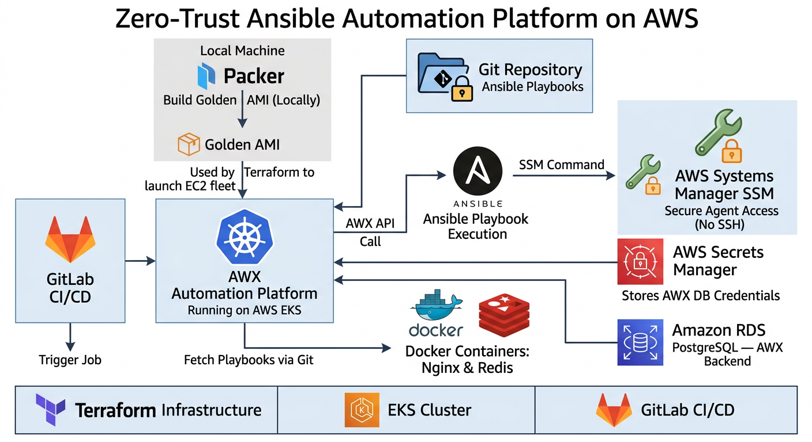
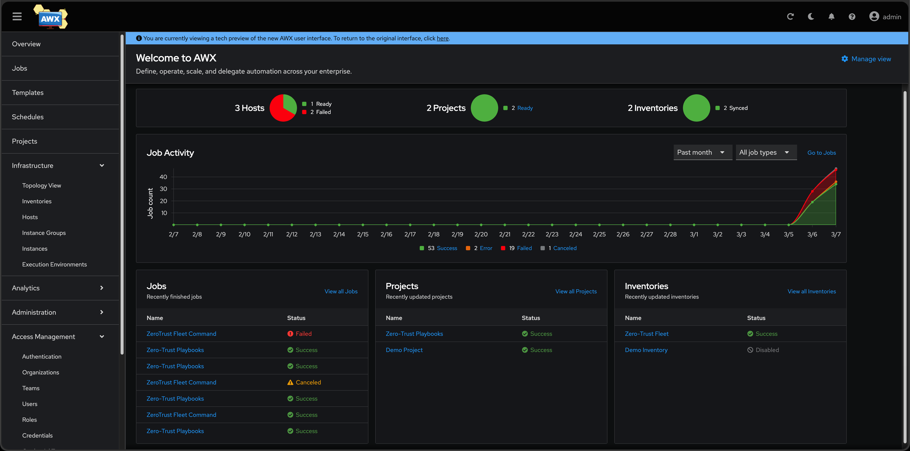
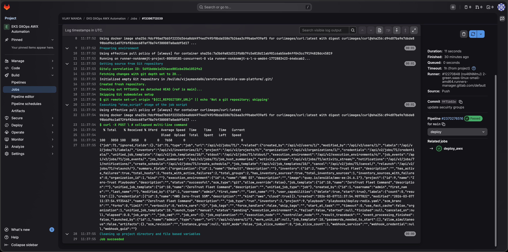
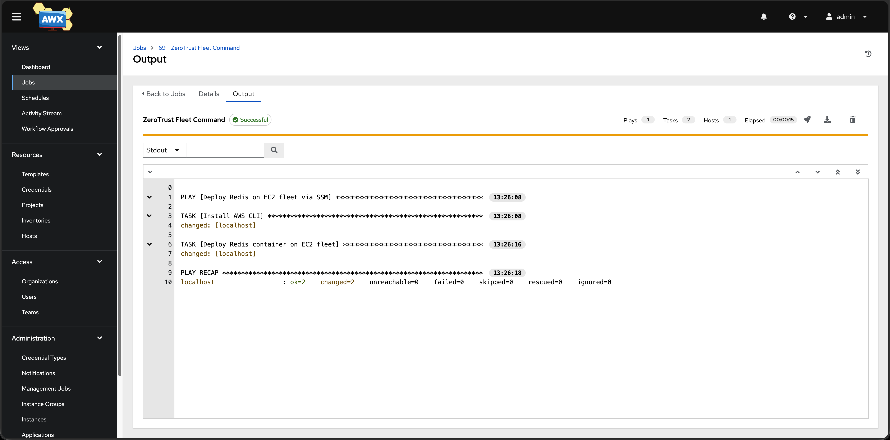
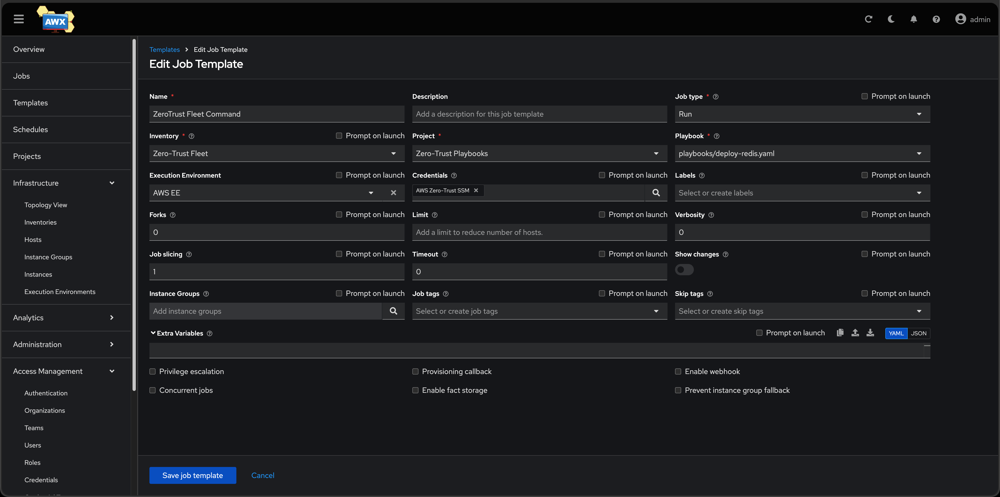
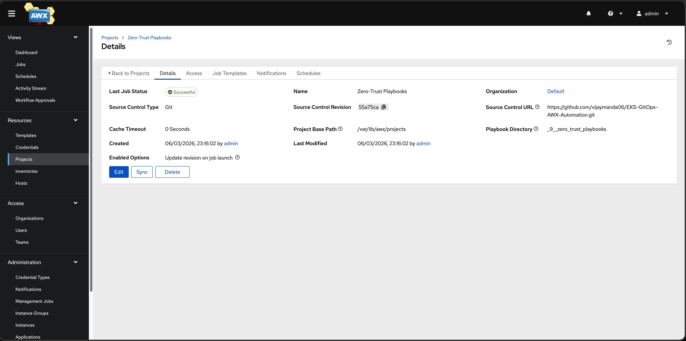
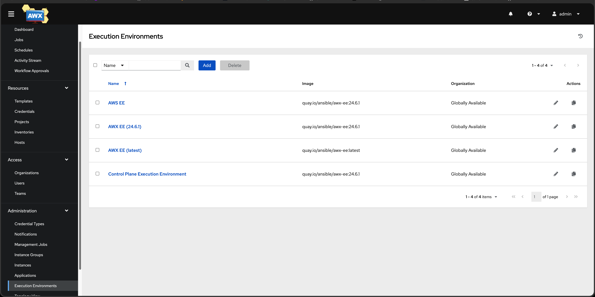
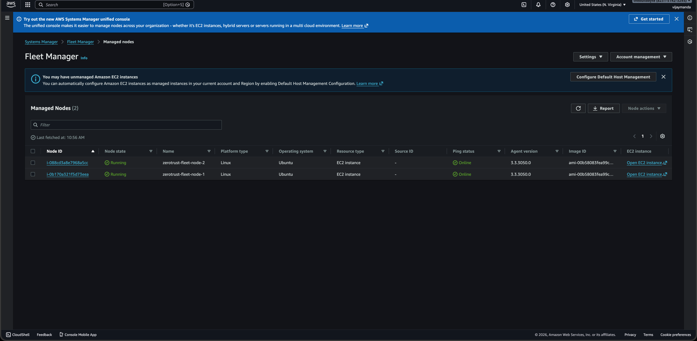

# Zero-Trust Immutable Infrastructure Pipeline



## Problem Statement (Why this project)

In many companies there are a lot of servers running in cloud environments like AWS. DevOps teams often need to install software, run commands, deploy containers, or update configurations on those servers. Traditionally people used SSH to log into servers and run commands manually or through scripts. But this approach is not very secure or scalable, especially when you have dozens or hundreds of machines.

Another problem is that CI/CD pipelines usually handle application builds, but there still needs to be a reliable way to run automation tasks on infrastructure. Teams need a centralized platform where automation can be executed safely, audited, and integrated with pipelines.

So the idea of this project was to build a central automation platform that can trigger Ansible playbooks from pipelines and securely execute tasks on private servers without opening SSH access.

## What AWX / Ansible Tower is

AWX is the open-source upstream project for Ansible Tower (now Red Hat Ansible Automation Platform). It is basically a web-based automation platform for Ansible. Instead of running Ansible from your laptop or CLI, AWX gives you a UI, API, inventory management, job scheduling, logging, and role-based access control for running Ansible playbooks in a centralized way.

In simple terms, it makes Ansible easier to run in a team environment.

**Difference in simple terms:**

**AWX**
- Open-source upstream project
- Community supported
- Free to use
- Good for learning and internal automation

**Red Hat Ansible Automation Platform (Ansible Tower)**
- Enterprise product from Red Hat
- Paid subscription
- Includes official support, security patches, automation analytics, and enterprise features

So in this project I used AWX (open-source), but the architecture is almost the same as the enterprise automation platform used in companies. It is deployed inside Kubernetes using Helm on AWS EKS.

Inside AWX we configured:
- Inventory for the EC2 fleet
- Credentials for AWS access
- Execution environments
- Job templates
- Connection to the Git repository that stores playbooks

When a job runs, AWX fetches playbooks from the connected Git repository and executes them against the infrastructure.

## What I actually built (project explanation)

So what I did in this project was I built a small automation platform on AWS. I created the infrastructure using Terraform and deployed everything inside an Amazon EKS cluster. Inside that Kubernetes cluster I installed AWX using Helm.

The idea was to run AWX as a centralized automation service. Instead of running Ansible from my laptop, AWX runs playbooks from inside the cluster.

**Golden AMI using Packer**

Before creating the EC2 fleet, a Golden AMI was built using Packer.

This AMI includes the base configuration required for the servers, such as:
- Docker installation
- SSM agent configuration
- Base OS configuration

Using a Golden AMI helps ensure that every instance in the fleet starts from a consistent base image.
This is a common practice in many DevOps environments to standardize infrastructure.

I also created a small EC2 fleet which acts like application servers. These servers were kept completely private — no SSH access and no inbound ports open. To manage them securely I used AWS Systems Manager. This allows commands to run on EC2 instances without opening SSH.

Then I connected the automation workflow with GitLab CI pipelines. Whenever a pipeline runs, it calls the AWX API, which triggers an Ansible playbook. That playbook then uses SSM to execute commands on the private EC2 instances.

For testing I used simple examples like deploying Docker containers (nginx or redis) on those servers. The interesting part is that the servers were completely private and automation still worked through AWS SSM.

I also added some security improvements like restricting outbound network access and using VPC endpoints so the servers only communicate with AWS services instead of the public internet.

So the overall flow looks like this:

```text
[Packer locally] → Golden AMI
Terraform → VPC + EKS + RDS + Secrets Manager
GitLab CI → AWX API → Ansible → SSM → Private EC2 fleet
```

## GitLab CI Pipeline

The `.gitlab-ci.yml` triggers the automation flow. It:
- Authenticates to AWX using a stored CI variable (`AWX_TOKEN`)
- Calls the AWX API to launch a Job Template by ID
- Waits for the job to complete and checks the status

## 1️⃣ Kubernetes Nodes (EKS)

```bash
$ kubectl get nodes
NAME                          STATUS   ROLES    AGE   VERSION
ip-10-0-47-119.ec2.internal   Ready    <none>   11h   v1.32.12-eks-efcacff
ip-10-0-9-101.ec2.internal    Ready    <none>   11h   v1.32.12-eks-efcacff
```

## 2️⃣ Kubernetes Pods (Platform services)

```bash
$ kubectl get pods -A

NAMESPACE          NAME                                                READY   STATUS      RESTARTS   AGE
argocd             argocd-application-controller-0                     1/1     Running     0          10h
argocd             argocd-applicationset-controller-6786676b4d-r7kg8   1/1     Running     0          10h
argocd             argocd-dex-server-86f976c75-pndzd                   1/1     Running     0          10h
argocd             argocd-notifications-controller-8c68bc66d-c7zjn     1/1     Running     0          10h
argocd             argocd-redis-5f9fd8f7fb-2nxgz                       1/1     Running     0          10h
argocd             argocd-repo-server-694d5579d9-f84pd                 1/1     Running     0          10h
argocd             argocd-server-7c6d5847dc-vw852                      1/1     Running     0          10h

awx                awx-operator-controller-manager-799967c78c-vz2gs    2/2     Running     0          10h
awx                awx-task-547bbcd565-gmtm4                           4/4     Running     0          10h
awx                awx-web-94d574749-mnjjp                             3/3     Running     0          10h
awx                awx-migration-24.6.1-t69zq                          0/1     Completed   0          10h

external-secrets   external-secrets-8545698689-bdbcn                   1/1     Running     0          10h
external-secrets   external-secrets-cert-controller-968fb546c-mmbwc    1/1     Running     0          10h
external-secrets   external-secrets-webhook-58fd6f5497-cxvfq           1/1     Running     0          10h

kube-system        aws-load-balancer-controller-78d95f6f5b-xxbpb       1/1     Running     0          10h
kube-system        aws-load-balancer-controller-78d95f6f5b-z9g24       1/1     Running     0          10h
kube-system        aws-node-dffqb                                      2/2     Running     0          11h
kube-system        aws-node-x82jc                                      2/2     Running     0          11h
kube-system        coredns-5ffbd497c5-pbgc8                            1/1     Running     0          10h
kube-system        coredns-5ffbd497c5-zqzrq                            1/1     Running     0          10h
kube-system        ebs-csi-controller-5b7b67d46-fwxk5                  6/6     Running     0          11h
kube-system        ebs-csi-controller-5b7b67d46-gl45t                  6/6     Running     0          11h
kube-system        ebs-csi-node-69zqr                                  3/3     Running     0          11h
kube-system        ebs-csi-node-gfsgn                                  3/3     Running     0          11h
kube-system        kube-proxy-lcm5d                                    1/1     Running     0          11h
kube-system        kube-proxy-rxckc                                    1/1     Running     0          11h
```

## 3️⃣ Docker Containers running on EC2 fleet

```bash
$ sudo docker ps

CONTAINER ID   IMAGE     COMMAND                  CREATED         STATUS         PORTS                                 NAMES
c247b52801dc   redis:7   "docker-entrypoint.s…"   21 minutes ago  Up 21 minutes  0.0.0.0:6379->6379/tcp                redis
72bb536a13f0   nginx     "/docker-entrypoint.…"   3 hours ago     Up 3 hours     0.0.0.0:80->80/tcp                    nginx
```

## 4️⃣ Open Ports on EC2 Instance

```bash
$ sudo ss -tulnp

Netid   State    Recv-Q   Send-Q   Local Address:Port    Peer Address:Port   Process
tcp     LISTEN   0        4096     0.0.0.0:80             0.0.0.0:*           docker-proxy
tcp     LISTEN   0        4096     [::]:80                [::]:*              docker-proxy
udp     UNCONN   0        0        127.0.0.53:53          0.0.0.0:*           systemd-resolved
```
*(Shows nginx container exposing port 80)*

## 5️⃣ SSM Command Result

Example output when Redis was deployed through AWX:

```json
{
  "CommandId": "7aa9fa07-d792-4b86-b07e-dee300ea0996",
  "InstanceId": "i-088cd3a8e7968a5cc",
  "Status": "Success",
  "DocumentName": "AWS-RunShellScript",
  "Output": "Status: Downloaded newer image for redis:7"
}
```






### Automation Proof

**AWX Job Template & Execution:**



**Private Nodes & Deployment Success:**




This basically demonstrates how infrastructure automation can be done in a secure way without logging into servers manually.


## Project Structure

```
.
├── .gitignore
├── README.md
├── terraform/
│   ├── main.tf                     # Providers, backend, data sources
│   ├── variables.tf                # All configurable variables
│   ├── terraform.tfvars.example    # Example values
│   ├── vpc.tf                      # VPC module (3 AZs)
│   ├── eks.tf                      # EKS cluster + node group
│   ├── rds.tf                      # PostgreSQL for AWX
│   ├── secrets.tf                  # Secrets Manager
│   ├── iam.tf                      # IRSA roles (ALB, ESO, EBS CSI)
│   ├── helm.tf                     # Helm releases (ArgoCD, ALB, ESO, AWX)
│   └── outputs.tf                  # Cluster, RDS, access outputs
├── kubernetes/
│   ├── awx/
│   │   └── awx-instance.yaml       # AWX Custom Resource
│   ├── external-secrets/
│   │   ├── cluster-store.yaml      # ClusterSecretStore for AWS
│   │   └── awx-secrets.yaml        # ExternalSecrets for DB + admin
│   └── argocd-apps/
│       └── awx.yaml                # ArgoCD Application for AWX
├── collections/                    # Contains required Ansible collections (community.aws) used by playbooks for SSM
└── packer/                         # EC2 Golden AMI
    ├── aws-ubuntu.pkr.hcl
    └── setup-scripts/
        └── install.sh
```

## Technology Stack

| Component | Version |
|---|---|
| Terraform | >= 1.9.0 |
| AWS Provider | ~> 6.0 (6.35.1) |
| VPC Module | 6.6.0 |
| EKS Module | 21.15.1 |
| Kubernetes | 1.33 |
| ArgoCD | 7.8.0 (Helm) |
| AWX Operator | 2.19.1 (Helm) |
| ESO | 0.12.1 (Helm) |
| ALB Controller | 1.11.0 (Helm) |
| RDS PostgreSQL | 16 |
| Packer | >= 1.9.0 |


## Deployment Flow

```
Terraform Apply
    ├── VPC + Subnets (3 AZs)
    ├── EKS Cluster + Node Group
    ├── RDS PostgreSQL
    ├── AWS Secrets Manager
    ├── ALB Controller (Helm)
    ├── ArgoCD (Helm)
    ├── External Secrets Operator (Helm)
    └── AWX Operator (Helm)
         ↓
kubectl apply K8s manifests
    ├── ClusterSecretStore
    ├── ExternalSecrets → K8s Secrets
    └── AWX CR → awx-web + awx-task + redis
```
